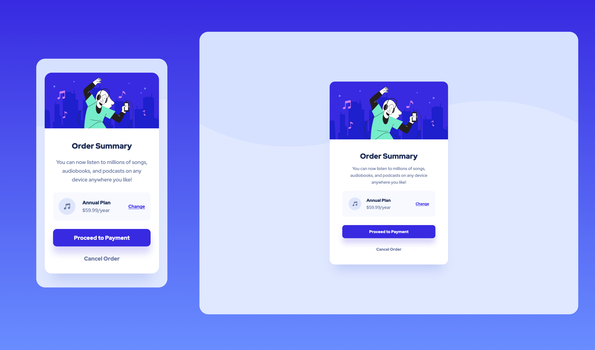

# Frontend Mentor - Order summary card solution

This is a solution to the [Order summary card challenge on Frontend Mentor](https://www.frontendmentor.io/challenges/order-summary-component-QlPmajDUj). Frontend Mentor challenges help you improve your coding skills by building realistic projects. 

## Table of contents

- [Overview](#overview)
  - [The challenge](#the-challenge)
  - [Screenshot](#screenshot)
  - [Links](#links)
- [My process](#my-process)
  - [Built with](#built-with)
  - [What I learned](#what-i-learned)
  - [Useful resources](#useful-resources)
- [Author](#author)

## Overview

### The challenge

Users should be able to:

- See hover states for interactive elements

### Screenshot

### Links

- Solution URL: [https://github.com/LucLhote/FrontendMentor-Order-summary-component-challenge](https://github.com/LucLhote/FrontendMentor-Order-summary-component-challenge)
- Live Site URL: [https://luclhote.github.io/FrontendMentor-Order-summary-component-challenge/](https://luclhote.github.io/FrontendMentor-Order-summary-component-challenge/)

## My process

### Built with

- Semantic HTML5 markup
- CSS custom properties
- Flexbox
- Mobile-first workflow

### What I learned

I discovered the ``text-underline-offset`` property. When comparing the version I had and the one I was supposed to have, I realized that the underline in my edit link was too far from the text. I tried to find a way to make it closer to text and found this property.

### Useful resources

- [text-underline-offset property](https://developer.mozilla.org/en-US/docs/Web/CSS/text-underline-offset) - This helped me set the offset for my underlined text decoration of the "change" link.

## Author

- Email - [luc.lhote@outlook.com](luc.lhote@outlook.com)
- Frontend Mentor - [@LucLhote](https://www.frontendmentor.io/profile/LucLhote)
- LinkedIn - [Luc Lhote](https://www.linkedin.com/in/luclhote/)
- freeCodeCamp - [@LucLh](https://www.freecodecamp.org/LucLh)
- freeCodeCamp Forum - [@LucLh](https://forum.freecodecamp.org/u/luclh/summary)
